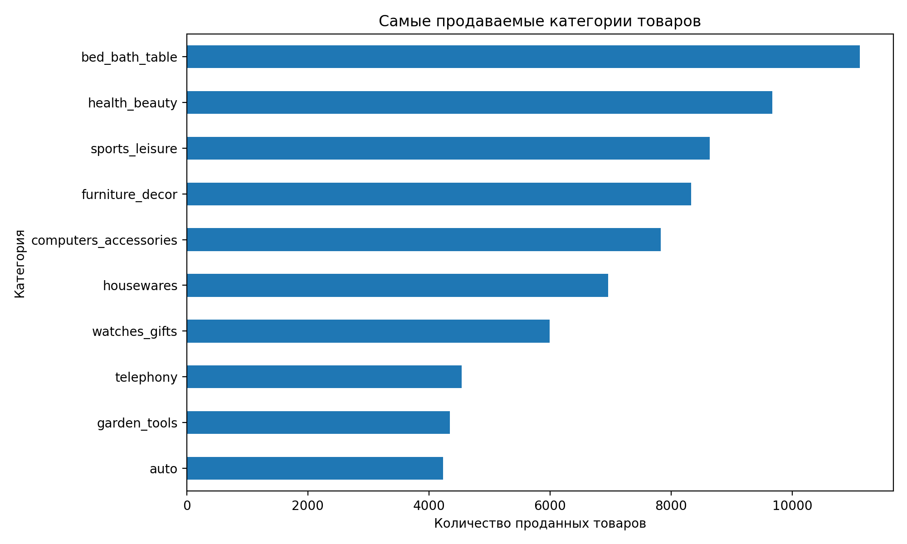
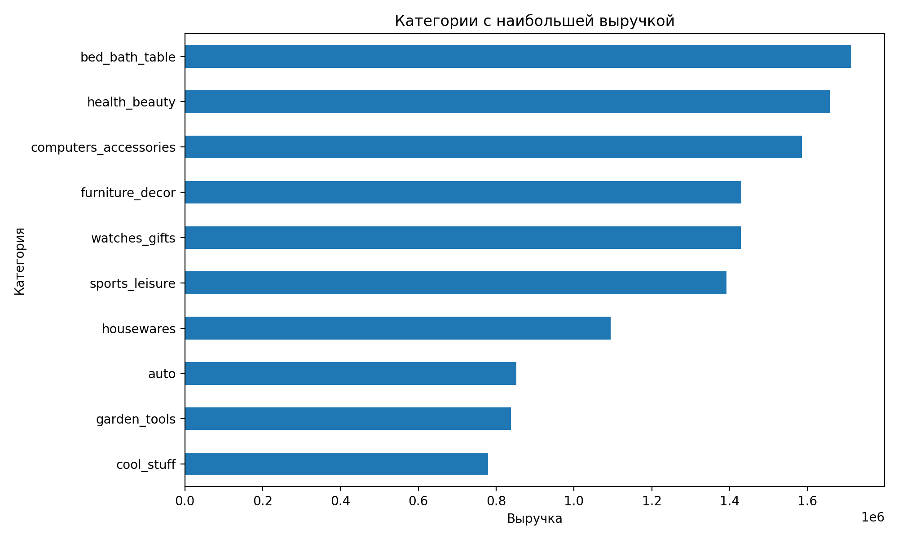
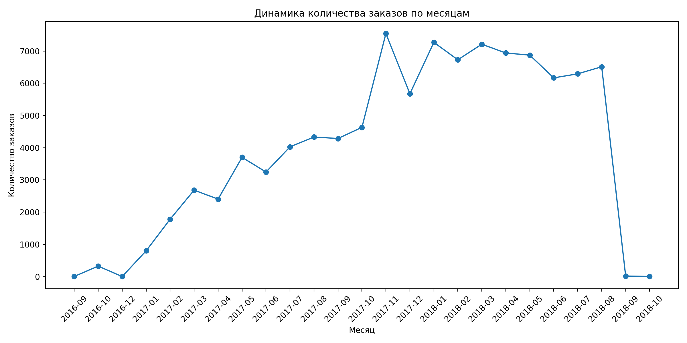
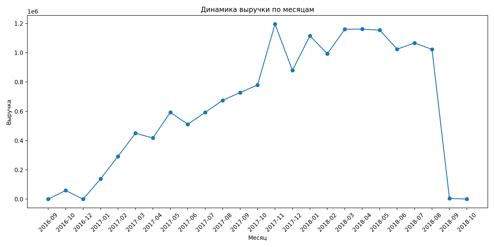
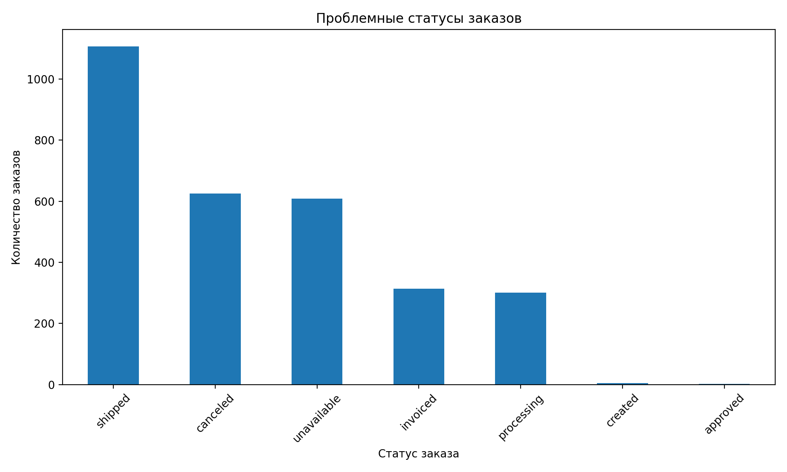

# Marketplace Analysis (PostgreSQL + Python)

Анализ данных маркетплейса Olist с использованием PostgreSQL, SQL, Python (Pandas) и Matplotlib.

---

# О проекте

В этом проекте я проанализировала данные маркетплейса Olist и ответила на несколько практических вопросов:

- какой объём продаж проходит через платформу;
- как распределяются покупки между клиентами;
- какие категории товаров приносят больше всего продаж и выручки;
- как менялись продажи во времени;
- какие выводы можно использовать для дальнейшего анализа продукта.

Для расчёта метрик использовался PostgreSQL, для обработки данных и построения графиков — Pandas и Matplotlib.

---

# Стек

## SQL

- PostgreSQL
- JOIN
- GROUP BY
- Aggregate Functions
- Window Functions
- CTE

## Python

- Pandas
- Matplotlib
- Jupyter Notebook

## Что анализировалось

- продажи;
- клиенты;
- категории товаров;
- выручка;
- динамика продаж;
- качество выполнения заказов.

---

# Данные

**Источник данных**

Olist Brazilian E-Commerce Dataset

https://www.kaggle.com/datasets/olistbr/brazilian-ecommerce

**Используемые таблицы**

- customers
- olist_orders_dataset
- olist_order_items_dataset
- olist_order_payments_dataset
- olist_products_dataset
- product_category_name_translation

---

# Структура проекта

```text
marketplace-analysis/

README.md

sql/
├── 01_basic_metrics.sql
├── 02_customer_analysis.sql
├── 03_product_analysis.sql
├── 04_revenue_analysis.sql
├── 05_sales_trend_analysis.sql
└── 06_delivery_analysis.sql

notebooks/
└── marketplace_analysis.ipynb

images/
├── problem_order_statuses.png
├── top_categories.png
├── revenue_categories.png
├── monthly_orders.png
└── monthly_revenue.png
```

---

# 1. Общие показатели

| Показатель | Значение |
|------------|---------:|
| Всего заказов | 99,441 |
| Уникальных клиентов | 96,096 |
| Общая выручка | $16,008,872.12 |
| Средний чек | $154.10 |

За рассматриваемый период маркетплейс обработал почти **100 тысяч заказов**.

Средний чек составил **154 доллара**, а суммарная выручка превысила **16 миллионов долларов**. Эти показатели используются как базовая точка для сравнения категорий товаров, поведения клиентов и динамики продаж.

---

# 2. Анализ клиентов

## Распределение заказов

| Заказов на клиента | Клиенты |
|-------------------:|---------:|
| 1 | 93,099 |
| 2 | 2,745 |
| 3 | 203 |
| 4 | 30 |
| 5 | 8 |
| 6 | 6 |
| 7 | 3 |
| 9 | 1 |
| 17 | 1 |

## Основные метрики

| Показатель | Значение |
|------------|---------:|
| Среднее число заказов на клиента | 1.03 |
| Повторных клиентов | 2,997 |
| Доля повторных клиентов | 3.12% |

Почти все пользователи сделали только один заказ.

Доля повторных покупателей составляет **3.12%**, поэтому основная часть продаж приходится на новых клиентов.

По этим данным нельзя сделать вывод о причинах низкой доли повторных покупок. Следующим шагом можно исследовать удержание пользователей (Retention), время между заказами и влияние программ лояльности на повторные покупки.
---

# 3. Анализ категорий товаров

Сначала я посмотрела, какие категории формируют основной объём продаж.

| Категория | Продано товаров |
|-----------|----------------:|
| bed_bath_table | 11,115 |
| health_beauty | 9,670 |
| sports_leisure | 8,641 |
| furniture_decor | 8,334 |
| computers_accessories | 7,827 |
| housewares | 6,964 |
| watches_gifts | 5,991 |
| telephony | 4,545 |
| garden_tools | 4,347 |
| auto | 4,235 |



Лидером по количеству продаж стала категория **bed_bath_table**.

В первую десятку также вошли товары для дома, красоты, спорта и электроника. Большинство лидирующих категорий относятся к товарам массового спроса, что характерно для крупных маркетплейсов.

При этом большое количество продаж ещё не означает максимальную выручку. Поэтому следующим шагом был анализ дохода по категориям.

---

# 4. Анализ выручки

| Категория | Выручка |
|-----------|---------:|
| bed_bath_table | $1,712,553.67 |
| health_beauty | $1,657,373.12 |
| computers_accessories | $1,585,330.45 |
| furniture_decor | $1,430,176.39 |
| watches_gifts | $1,429,216.68 |
| sports_leisure | $1,392,127.56 |
| housewares | $1,094,758.13 |
| auto | $852,294.33 |
| garden_tools | $838,280.75 |
| cool_stuff | $779,698.00 |



По суммарной выручке лидирует та же категория — **bed_bath_table**.

Интересно, что **computers_accessories** занимает третье место по выручке, хотя по количеству продаж уступает нескольким другим категориям. Это говорит о более высокой средней стоимости товаров в этой категории.

При сравнении категорий важно учитывать сразу несколько метрик. Одинаковый объём продаж может давать разную выручку, если существенно отличается средний чек.

---

# 5. Категории с самым высоким средним чеком

| Категория | Средний чек |
|-----------|------------:|
| computers | $1,268.73 |
| fixed_telephony | $763.88 |
| agro_industry_and_commerce | $471.15 |
| home_appliances_2 | $464.79 |
| office_furniture | $363.79 |
| signaling_and_security | $340.74 |
| construction_tools_safety | $330.11 |
| musical_instruments | $324.62 |
| small_appliances | $321.80 |
| air_conditioning | $301.89 |

Категория **computers** имеет самый высокий средний чек — более **$1,200**.

При этом она не входит в число лидеров по количеству продаж. Это хороший пример того, что дорогие товары могут приносить значительную выручку даже при относительно небольшом количестве заказов.

При анализе ассортимента стоит учитывать сразу три показателя:

- количество продаж;
- средний чек;
- суммарную выручку.

Только их совместный анализ позволяет объективно оценить вклад категории в результаты бизнеса.
---

# 6. Анализ динамики продаж

## Количество заказов

Пик количества заказов пришёлся на **ноябрь 2017 года** — **7,544 заказа**.



В течение 2017 года число заказов постепенно росло. Наиболее заметный прирост наблюдается во второй половине года.

По имеющимся данным нельзя определить причины такого роста, однако его стоит учитывать при дальнейшем анализе сезонности и маркетинговых активностей.

---

## Выручка

Максимальная месячная выручка также была зафиксирована в **ноябре 2017 года** и составила **$1,194,882.80**.



Динамика выручки практически повторяет динамику количества заказов. Это говорит о том, что рост доходов происходил в первую очередь за счёт увеличения объёма продаж.

---

# 7. Анализ выполнения заказов

| Показатель | Значение |
|------------|---------:|
| Доля успешно доставленных заказов | 97.02% |
| Доля отменённых заказов | 0.63% |
| Доля недоступных заказов | 0.61% |
| Среднее время доставки | 12.5 дней |



Большинство заказов были успешно доставлены клиентам.

Доля отменённых и недоступных заказов невелика, однако именно эти статусы требуют отдельного анализа, поскольку напрямую влияют на пользовательский опыт и могут снижать вероятность повторной покупки.

---

# Основные выводы

По результатам анализа можно выделить несколько наблюдений:

- маркетплейс обработал более **99 тысяч заказов**;
- клиентская база насчитывает **96 тысяч уникальных покупателей**;
- общая выручка превысила **16 миллионов долларов**;
- только **3.12%** клиентов совершили повторную покупку;
- категория **bed_bath_table** лидирует как по количеству продаж, так и по общей выручке;
- **computers_accessories** входит в число лидеров по выручке благодаря более высокому среднему чеку;
- продажи и выручка росли на протяжении 2017 года;
- более **97%** заказов были успешно доставлены.

---

# Что можно исследовать дальше

Этот проект можно расширить следующими задачами:

- когортный анализ клиентов;
- анализ удержания пользователей (Retention);
- RFM-сегментация клиентов;
- ABC-анализ категорий товаров;
- моделирование A/B-теста;
- построение интерактивного дашборда в Power BI или Tableau.

---

# Приобретённые навыки

В ходе работы над проектом были использованы:

### SQL

- JOIN
- GROUP BY
- Aggregate Functions
- Window Functions
- CTE
- расчёт продуктовых метрик

### Python

- Pandas
- Matplotlib
- обработка данных
- визуализация результатов

### Аналитика

- анализ клиентов;
- анализ категорий товаров;
- анализ выручки;
- анализ динамики продаж;
- интерпретация бизнес-метрик.

---

# Заключение

В рамках проекта были рассчитаны ключевые показатели маркетплейса, выполнен анализ клиентов, категорий товаров, выручки и динамики продаж.

Проект показывает навыки работы с PostgreSQL, SQL, Python, Pandas и Matplotlib, а также умение не только рассчитывать метрики, но и интерпретировать результаты для решения бизнес-задач.

